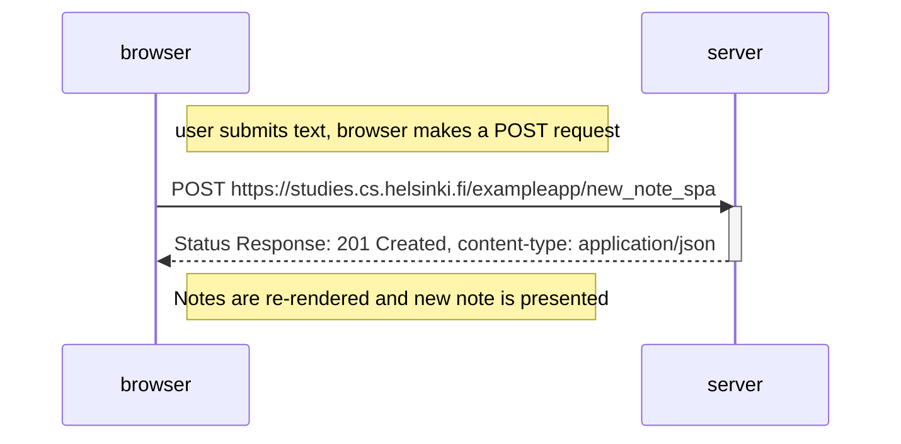

```mermaid
sequenceDiagram
    participant browser
    participant server

    Note right of browser: user submits text, browser makes a POST request

    browser->>server: POST https://studies.cs.helsinki.fi/exampleapp/new_note_spa
    activate server
    server-->>browser: Status Response: 201 Created, content-type: application/json 
    deactivate server

    Note right of browser: Notes are re-rendered and new note is presented
```